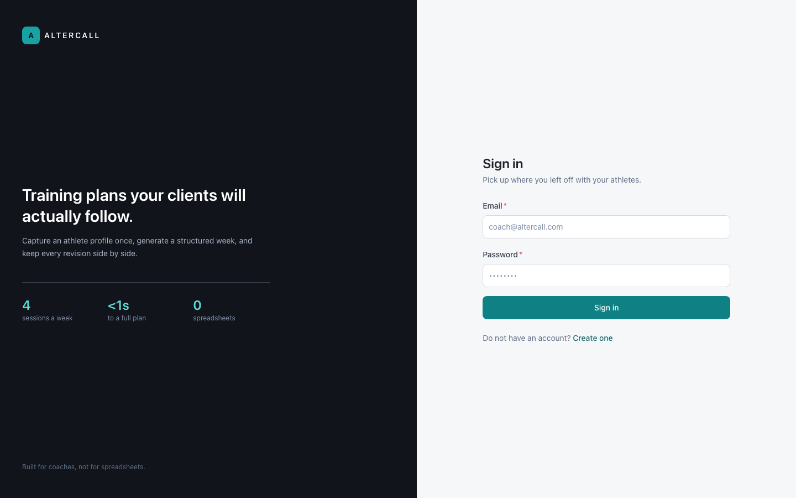
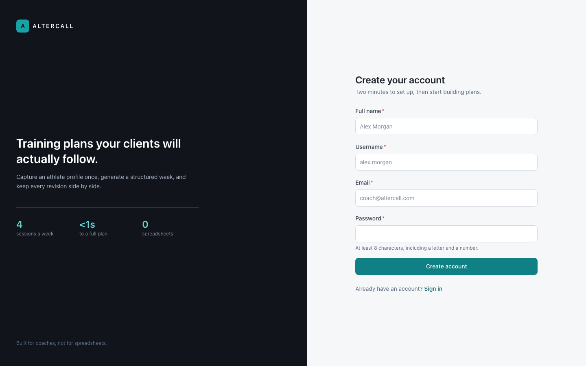
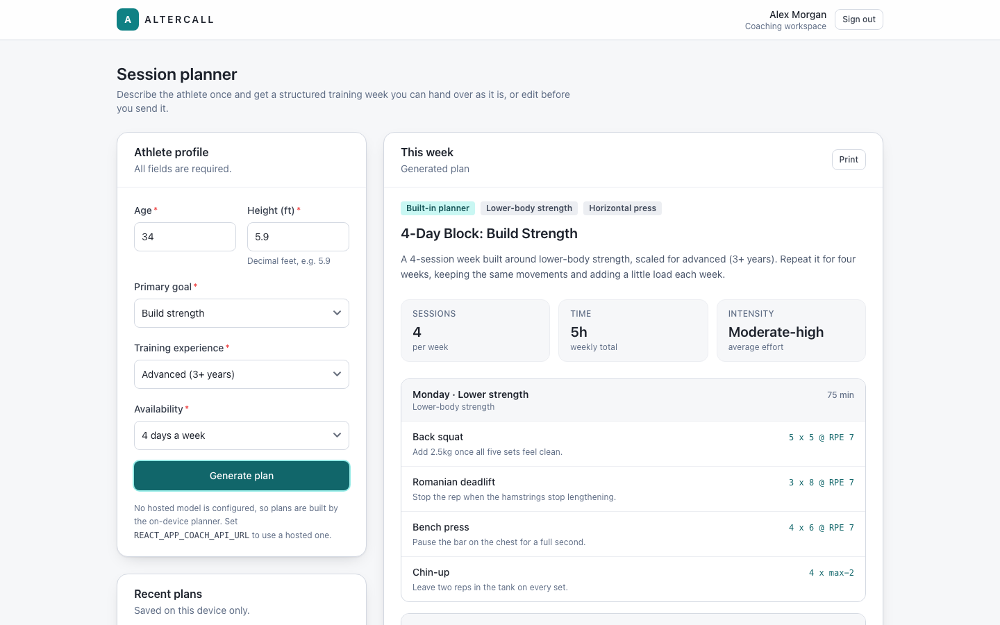
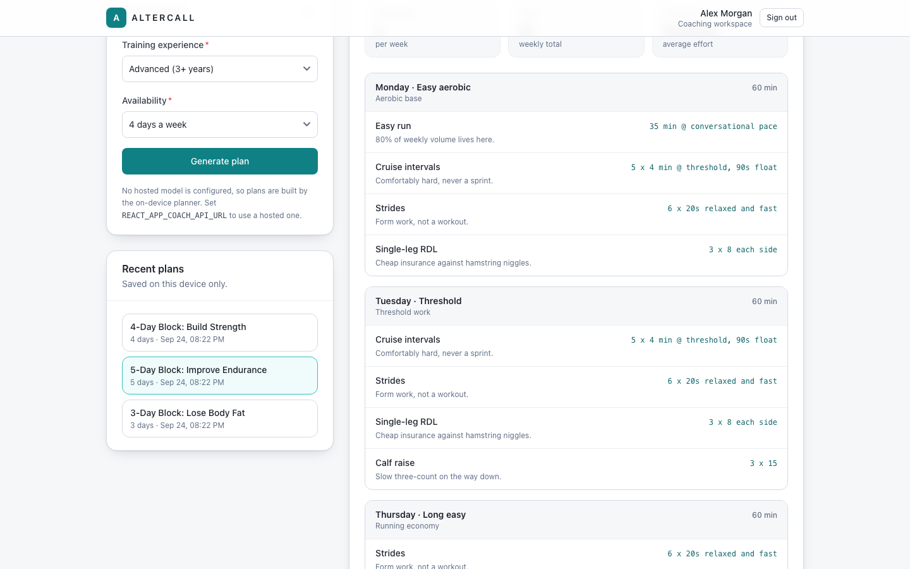
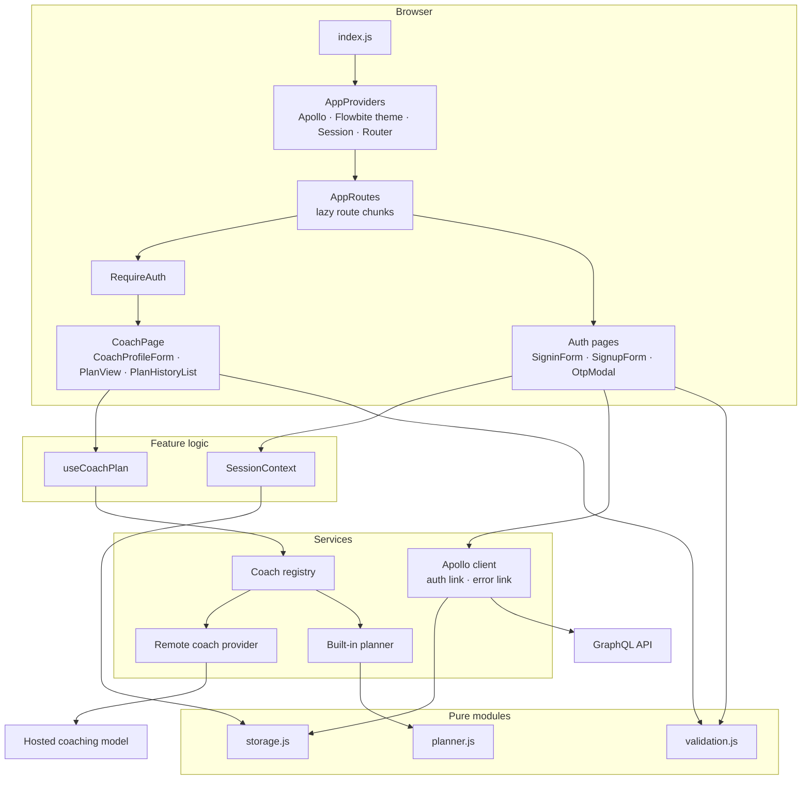
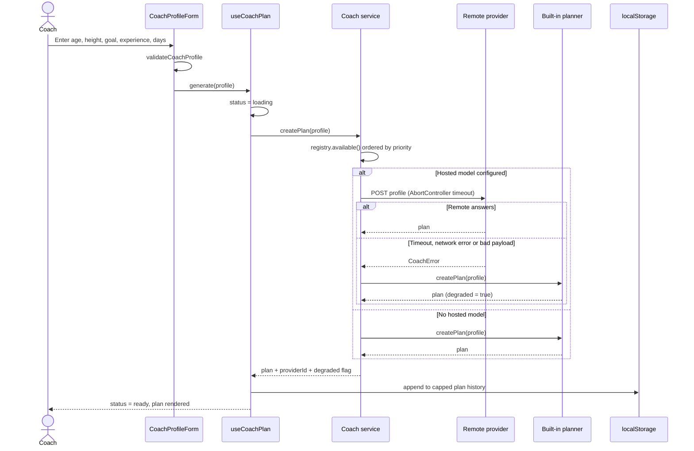

# ALTERCALL Web

A React front end for a coaching platform. Coaches sign up, confirm their email with a
one-time code and sign in against a GraphQL backend; once inside, they describe an
athlete and get a structured weekly training plan back — sessions, movements,
prescriptions and coaching notes — which is saved locally so previous plans stay one
click away.

Plan generation goes through a provider interface. If a hosted coaching model is
configured the app calls it; if it is not configured, or it fails, a deterministic
planner that ships with the bundle produces the plan in the browser. The app is
therefore fully usable with no AI credentials and no coaching backend.

## Screenshots

| Sign in                                           | Create account                                    |
| ------------------------------------------------- | ------------------------------------------------- |
|  |  |





Captured with Playwright at 1440x900 against a production build served locally
(`scripts/capture-screenshots.mjs`). The plans shown are real output from the built-in
planner, not mock-ups.

## Architecture



Dependencies point inward: pages depend on feature hooks, hooks depend on services,
services depend on pure modules. Nothing in `src/lib` or `src/services` imports React.

## Plan generation flow



## Quickstart

```sh
npm install
npm start          # http://localhost:3000
```

No backend is required to use the planner. Sign-up and sign-in do need a GraphQL API —
point `REACT_APP_GRAPHQL_URI` at it. To look around the planner without one, run the
app and set a session in the browser console:

```js
localStorage.setItem(
  "altercall.session",
  JSON.stringify({ accessToken: "dev", userName: "Alex Morgan" })
);
```

## Configuration

Copy `.env.example` to `.env.local`. Create React App only exposes variables prefixed
with `REACT_APP_`, and it inlines them **at build time** — changing one means rebuilding.

| Variable                     | Required | Default                         | Purpose                                                                   |
| ---------------------------- | -------- | ------------------------------- | ------------------------------------------------------------------------- |
| `REACT_APP_GRAPHQL_URI`      | No       | `http://localhost:8000/graphql` | GraphQL endpoint for sign-up, sign-in and OTP confirmation.               |
| `REACT_APP_COACH_API_URL`    | No       | _(empty)_                       | Hosted coaching model endpoint. Empty means the built-in planner is used. |
| `REACT_APP_COACH_TIMEOUT_MS` | No       | `12000`                         | Abort the hosted coaching call after this many milliseconds.              |
| `PORT`                       | No       | `3000`                          | Dev server port.                                                          |
| `WEB_PORT`                   | No       | `8560`                          | Host port published by `docker-compose.yml`.                              |

No provider API key is read in the browser. `REACT_APP_COACH_API_URL` is expected to
point at a server-side endpoint that holds any credentials.

## Development

```sh
npm start              # dev server with hot reload
npm test               # Jest + React Testing Library, watch mode
npm run test:ci        # single run, no watcher
npm run test:ci -- --coverage
npm run lint           # ESLint, zero warnings tolerated
npm run format         # Prettier
npm run build          # production bundle into build/
```

Docker:

```sh
docker compose up --build        # serves the production build on http://localhost:8560
```

The image is multi-stage (Node build, nginx runtime), runs as the non-root `nginx`
user on port 8080 inside the container, and has a healthcheck. The Docker image has
**not** been built or booted in this environment — the Dockerfile and compose file are
authored but unverified; `docker compose config` parses cleanly.

To regenerate the screenshots:

```sh
npm run build
npx serve -s build -l 8560
npx playwright install chromium
BASE_URL=http://127.0.0.1:8560 node scripts/capture-screenshots.mjs
```

## Project structure

```
src/
  app/                      Composition root
    App.jsx                 Providers + routes, nothing else
    routes.jsx              Route table with lazy page chunks
    providers/              Apollo, Flowbite theme, Session, Router
  config/
    env.js                  The only place process.env is read
  lib/                      Pure, framework-free modules
    validation.js           Form rules shared by every form
    storage.js              Safe localStorage: JSON, quota and private-mode safe
  services/
    apollo/client.js        Apollo client, auth link, 401 handling, cache policy
    coach/
      registry.js           Provider registry - the extension seam
      planner.js            Built-in planner (pure domain logic)
      providers/            Remote HTTP provider and the local provider
      index.js              Wiring plus the fallback policy
  features/
    auth/                   Mutations, session context, forms, route guard, pages
    coach/                  Plan hook, plan history, planner components and page
  components/ui/            Shared presentational kit (Panel, Field, Alert, ...)
  test/utils.jsx            Render helper that mirrors the real provider tree
docs/screenshots/           README images
scripts/                    Screenshot capture
```

## Design notes

**Layering.** The original app put network calls, storage writes and validation inline
in three form components. Business logic now lives in `src/lib` and `src/services`,
which are plain JavaScript modules with no React import; feature hooks adapt them to
components; components render. That is why 134 tests run in about five seconds with no
browser and no backend — most of them never mount a component.

**The provider seam.** Coaching backends are the one thing about this product that is
certain to change, so that is where the extension point went. A provider is
`{ id, label, priority, isAvailable(), createPlan(profile) }`; the registry resolves the
highest-priority available one, and the service falls back down the list on failure,
marking the resulting plan `degraded` so the UI can say so instead of silently lying.
Adding a vendor is one file and one `register()` call.

**Graceful degradation is the default, not the error path.** The built-in planner is a
real feature, not a stub: deterministic rules produce a four-movement session per
training day, scaled by experience, with notes keyed off age and height. With no
`REACT_APP_COACH_API_URL` set the app is fully functional, which is also what makes the
screenshots above reproducible without any credentials.

**Scalability — where the bytes actually went.** For a front end of this size the
bottleneck is the bundle, not the server. Two measurements drove the work:

- The original build produced a single `main.js` of **174.53 kB gzipped**.
- `flowbite-react@0.7` does not declare `sideEffects: false`, so importing from its
  package root defeats tree-shaking and pulls in Datepicker, Carousel, `react-markdown`
  and `react-icons` whether you use them or not. Routing the eight components this app
  uses through one barrel of deep imports (`src/components/ui/flowbite.js`) cut the main
  chunk from **155.48 kB to 131.37 kB gzipped**, and the total JS transferred on the
  sign-in route from **176.6 kB to 153.1 kB gzipped** (measured with Playwright against
  a local static server, gzip level 9).

Route-level code splitting is also in place, but honesty about its effect: because every
route uses the same UI kit, it only keeps the sign-up page's own code (about 4 kB
gzipped) off the sign-in route. It is worth keeping as the app grows; it is not where
the win came from.

Other deliberate limits: plan history is capped at eight entries so `localStorage`
cannot grow without bound, and a superseded plan request is discarded by request id so a
slow response cannot overwrite a newer one.

**Security.** Access tokens are attached by an Apollo auth link and cleared
automatically when the server answers `UNAUTHENTICATED` or HTTP 401. The GraphQL
endpoint used to be a hardcoded `http://` address of a specific EC2 instance committed
to the repository; it is now configuration with a localhost default.

## Limitations

- **Tokens live in `localStorage`.** That is XSS-exposed. A production deployment should
  move to an httpOnly refresh cookie; the session module is the single place that would
  change.
- **No token refresh.** `refreshToken` is stored but never exchanged — an expired access
  token signs the user out rather than renewing silently.
- **Plan history is per-device.** It is `localStorage`, not a server resource, so it does
  not follow a coach to another browser and is not shared with athletes.
- **Plans are not editable or exportable.** The Print button is the browser's own print
  dialog against a print stylesheet; there is no PDF export and no way to tweak a
  prescription before sending it.
- **The built-in planner is rule-based, not a model.** It is a reasonable template
  generator, not individualised coaching, and it does not know about injuries,
  equipment or training history.
- **Create React App is unmaintained.** react-scripts 5 still builds and tests cleanly
  here, but a move to Vite is the obvious next infrastructure step. Note that CRA 5
  ignores `postcss.config.js` and enables Tailwind purely because `tailwind.config.js`
  exists — that detail does not survive the migration.
- **The Docker image is unbuilt.** It is authored to a good standard but has not been
  built or run in this environment.
- **No end-to-end tests.** The suite covers units and component integration with a
  mocked Apollo link; nothing exercises a real GraphQL server.
