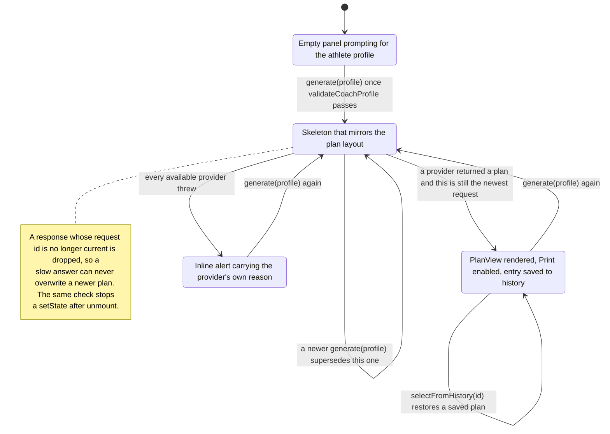

# ALTERCALL Web

The coach-facing front end of the AlterCall coaching platform. A coach signs up,
confirms their email with a one-time code, signs in, then describes an athlete once —
age, height, goal, experience, days available — and gets a structured training week
back: sessions, prescribed movements, a weekly load summary and coaching notes.

The product decision that shapes the whole codebase is that **a plan always arrives**.
Plan generation goes through a provider interface, and a deterministic planner ships
inside the bundle as the last provider in the chain. With no coaching backend, no API
key and no network, the planner still works — which is also why the screenshots below
could be captured without a server running.

## What a coach sees

| Sign in                                           | Create account                                    |
| ------------------------------------------------- | ------------------------------------------------- |
|  |  |

The two auth shots are empty forms — there is nothing to populate until a backend is
answering. The planner shots are real output:


Three plans were generated through the real UI before the last shot was taken, which is
why the history panel has entries in it. All four are 1440x900, captured by
`scripts/capture-screenshots.mjs` (Playwright, Chromium) against a production build
served locally.

## Why a plan always arrives

`src/services/coach/registry.js` is the extension seam. A provider is an object:

```
{ id, label, priority, isAvailable(), createPlan(profile) }
```

The registry validates that contract at `register()` time, sorts by descending
`priority` and hands back everything whose `isAvailable()` is true. `services/coach/index.js`
then walks that list: the first provider to return a plan wins, and a provider that
throws is logged and the next one is tried. Only the last failure propagates.

Two providers ship. `remoteCoachProvider` (priority 10) POSTs the profile to
`REACT_APP_COACH_API_URL` behind an `AbortController` timeout, maps every failure mode
onto a `CoachError` code — `timeout`, `network`, `failed`, `badResponse` — and normalises
both the structured plan shape and a legacy `{ workoutSuggestion }` string. It reports
itself unavailable when no URL is configured, so an unset variable is a routing decision
rather than a runtime error. `localCoachProvider` (priority 0) is always available and
calls the pure planner in `src/services/coach/planner.js`.

When a lower-priority provider answers, the result is flagged `degraded: true` with
`degradedReason` set to the upstream failure, so the UI can say a fallback happened
instead of quietly pretending the hosted model replied.

## What the right-hand panel is doing

`useCoachPlan` owns this and nothing else owns any of it — the page reads `status` and
renders one of four things.



Plan history is `localStorage`, newest first, capped at eight entries
(`HISTORY_LIMIT` in `src/features/coach/planHistory.js`) so it cannot grow without
bound. Selecting an entry re-renders it without regenerating anything.

## The three mutations it sends

Everything that leaves this app for the identity service is in
`src/features/auth/api/mutations.js`:

```graphql
signup(username, name, password, email) { user { username email } }
confirmUser(username, otp)              { success }
signin(username, password)              { accessToken refreshToken userId userName userEmail }
```

The server is the sibling `altercall-fitness` repo. `signin` returning flat
`userId` / `userName` / `userEmail` beside the tokens is the shape this client reads, and
those three fields are what `SessionContext` uses for the display name.

`src/services/apollo/client.js` builds the client from three links: an error link that
clears the stored session on `UNAUTHENTICATED`, `FORBIDDEN` or HTTP 401, an auth link
that attaches `Authorization: Bearer <accessToken>` when there is one, and the HTTP
link. Every dependency is injected — URI, token getter, sign-out callback, even the
terminating link — which is why the auth behaviour is unit-tested with no network.

Layering, in one sentence: `src/lib/` and `src/services/` are plain modules that import
no React, `src/features/{auth,coach}` adapt them through hooks and components,
`src/app/` is the composition root, and `src/config/env.js` is the only file that reads
`process.env`.

## Running it

```sh
npm install
npm start          # http://localhost:3000
```

The planner needs no backend. Sign-up and sign-in do — point `REACT_APP_GRAPHQL_URI` at
a GraphQL server. To walk straight into the planner without one, start the app and put a
session in the browser console:

```js
localStorage.setItem(
  "altercall.session",
  JSON.stringify({ accessToken: "dev", userName: "Alex Morgan" })
);
```

```sh
npm run test:ci                  # 16 suites, 134 tests
npm run test:ci -- --coverage    # thresholds committed at 85/70/80/85
npm run lint                     # ESLint, --max-warnings 0
npm run format:check             # Prettier
npm run build                    # production bundle into build/
```

The suite runs in under four seconds because most of it never mounts a component:
validation, storage, the planner, the registry, remote-provider error mapping and the
Apollo links are all plain-module tests. The rest drive real components through a mocked
Apollo link.

To regenerate the screenshots:

```sh
npm run build
npx serve -s build -l 8560
npx playwright install chromium
BASE_URL=http://127.0.0.1:8560 node scripts/capture-screenshots.mjs
```

`Dockerfile` is multi-stage (`node:20-alpine` build, `nginx:1.27-alpine` runtime) and
runs as the non-root `nginx` user on unprivileged port 8080, with `docker-compose.yml`
publishing `${WEB_PORT:-8560}` and mounting the root filesystem read-only. CRA inlines
`REACT_APP_*` at build time, so those arrive as **build args**, not runtime environment.
`docker compose config` parses, but the image has **not been built or booted here** —
treat it as authored and unverified.

## What it reads from the environment

Copy `.env.example` to `.env.local`. Create React App only exposes `REACT_APP_*`
variables and inlines them at build time, so changing one means rebuilding.

| Variable                     | Default                         | Purpose                                                                       |
| ---------------------------- | ------------------------------- | ----------------------------------------------------------------------------- |
| `REACT_APP_GRAPHQL_URI`      | `http://localhost:8000/graphql` | Identity service endpoint for sign-up, OTP confirmation and sign-in.          |
| `REACT_APP_COACH_API_URL`    | _(empty)_                       | Hosted coaching model. Empty means the built-in planner is the only provider. |
| `REACT_APP_COACH_TIMEOUT_MS` | `12000`                         | Abort the hosted coaching call after this many milliseconds.                  |
| `PORT`                       | `3000`                          | Dev server port.                                                              |
| `WEB_PORT`                   | `8560`                          | Host port published by `docker-compose.yml`.                                  |

No provider API key is read in the browser. `REACT_APP_COACH_API_URL` is expected to
point at a server-side endpoint that holds any credentials.

## Where the bytes went

`npm run build` reports `main.js` at **131.37 kB gzipped**. Getting there was one file.

flowbite-react 0.7.2 declares no `sideEffects` field in its `package.json` — check it
with `node -e "console.log(require('flowbite-react/package.json').sideEffects)"` — so
importing from the package root defeats tree-shaking and drags in Datepicker, Carousel,
`react-markdown` and `react-icons` whether you use them or not. `src/components/ui/flowbite.js`
is a barrel that re-exports the eight components this app actually uses from their
individual folders. Re-point that one file at `"flowbite-react"` and rebuild to see the
difference: **155.22 kB**, a 23.85 kB regression on every route.

The trade-off is that those are deep paths into the package's build output, not
published subpath exports, so a flowbite-react upgrade will need that file revisited.
Jest maps them to the CJS build via `moduleNameMapper`.

Route-level code splitting is also in place, and it earns less than it looks like it
should: every route uses the same UI kit, so it only keeps the sign-up page's own
3.98 kB off the sign-in route. Worth keeping as the app grows, but not where the win
came from.

## Known gaps

- **Sign-in asks for an email and sends it as a username.** The field is labelled Email
  and validated as one, then passed as the mutation's `username` variable. Whether that
  works depends entirely on what the identity service accepts as a username.
- **The athlete's goal never reaches the server.** `signup` sends name, username, email
  and password only. The goal the planner works from is collected after sign-in and
  lives only in this browser, so nothing about a coach's athletes is durable server-side.
- **Nothing has been run against a real GraphQL server.** Every mutation shape here is
  asserted against a mocked Apollo link. The contract is assumed, not verified.
- **Tokens live in `localStorage`**, which is XSS-exposed. `src/lib/storage.js` is the
  single place that would change to move to an httpOnly cookie.
- **No token refresh.** `refreshToken` is stored because the server returns it and is
  never exchanged — an expired access token signs the user out rather than renewing.
- **Plan history is per-device.** It does not follow a coach to another browser and is
  not shared with athletes.
- **Plans are not editable or exportable.** Print is the browser's own dialog against a
  stylesheet that hides the header and buttons. There is no PDF export and no way to
  adjust a prescription before handing it over.
- **The built-in planner is rule-based, not a model.** It is a defensible template
  generator; it knows nothing about injuries, equipment or training history.
- **Create React App is unmaintained.** react-scripts 5 still builds and tests cleanly,
  but a move to Vite is the obvious next infrastructure step.
- **No end-to-end tests**, and no accessibility audit beyond semantic markup and the
  labels the form kit emits.
